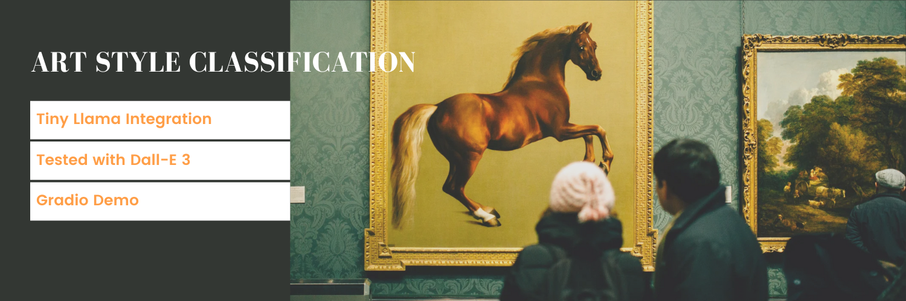

# Art Style Classifier and Analysis System



## 🎨 Overview
For our final Bootcamp project, I chose to train a CNN to classify a piece of artwork by its style, selecting
from popular art styles and movements. This classifying model is paired with a language model to answer user questions
and respond with key information about the artistic style. By doing this project, I hope to use the knowledge and tools I've learned during this Bootcamp, as well as additional technologies, to build a complete project that could be deployed in
a real world scenario.

### Key Features
- 🖼️ Multi-style art classification using CNN
- 💡 Intelligent art analysis and interpretation
- 📊 Detailed visual analytics and insights
- 🤖 Natural language interaction for art queries

### Components
- **CNN Classifier**
- **Language Model**
- **Data Pipeline**
- **Gradio Interface**

## 🚀 Development Roadmap

1. Initial data exploration and API evaluation
2. Development of artist-based data collection strategy
3. Image dataset compilation (9,114 initial images)
4. Data cleaning and preprocessing
5. CNN model development
6. Language model integration
7. Model performance optimization
8. Web interface development

## 📚 Dataset

### Data Collection Strategy

The data collection process evolved through several iterations to ensure high-quality, accurately labeled data:

#### Initial Approach

Explored three primary data sources:
- WikiArt
- Artsy
- Art Institute of Chicago (AIC)

**Challenges:**
- APIs lacked direct "style" or "movement" search capabilities
- First attempt combined WikiArt and AIC images, but label accuracy was inconsistent

#### Refined Methodology

Developed artist-based collection strategy:
- Created curated lists of artists for each art movement
- Queried APIs using artist names
- Collected up to 50 artworks per artist

**Dataset Statistics:**
- Initial dataset: 9,114 images
- Final processed dataset: 15,600 images after augmentation

### Dataset Distribution
[Insert your visualization of the classes here]

## Data Processing Pipeline

### 1. Dataset Curation

#### Style Remapping
- Refined 'contemporary' artist classifications into more specific styles
- Created detailed mapping for artists who worked across multiple movements
- Used artwork year and title data to accurately categorize pieces

#### Data Cleaning
- Removed duplicate entries
- Eliminated unmappable artists and generic 'contemporary' classification
- Conducted thorough dataframe validation

### 2. Quality Control

Custom filtering class implemented to ensure image quality:

#### Exclusion Criteria
- Removed preliminary drawings and sketches
- Filtered out low-quality images based on custom scoring system
- Eliminated overexposed photographs and low-resolution images

### 3. Image Preprocessing

Standardized image processing pipeline:

#### Image Resizing
- Standardized to 256 x 256 pixels
- Preserved original aspect ratio
- Applied mean color padding to maintain image context

#### Data Normalization
- Converted to floating-point arrays 
- Normalized pixel values to [0,1] range

#### Data Augmentation
Applied conservative augmentation techniques to preserve artistic style characteristics:

**Color Adjustments**
- Subtle brightness variation (±10%)
- Minimal contrast adjustment (±10%)
- Very subtle saturation changes (±5%)
- Minimal hue shifts (±5%)

**Geometric Transformations**
- Random horizontal flips
- Gentle rotation (±10 degrees)
- Random cropping (80% of original size)

**Quality Control**
- Automated checks for image brightness
- Contrast validation
- Skip generation for images failing quality thresholds

> Note: Augmentation was performed as a preprocessing step separate from training to optimize computational resources in Google Colab
## Training Imageset Composition

- 26 distinct art movement classes
- Balanced distribution: 600 images per class
- Total dataset size: 15,600 images
 - Initial collection: 9,114 images
 - Augmented to achieve class balance

[Insert visualization of final class distribution after processing]

## 🛠️ Technical Architecture

### Data Pipeline

#### Data Loading
- Images loaded from Google Drive to Colab runtime
- Conversion to RGB format
- Normalization to [0,1] range
- Float32 precision

#### Training Setup

**Data Split**
- 75/25 train/test split
- Stratified sampling to maintain class distribution
- One-hot encoding for 26 classes

**Input Processing**
- Image dimensions: 256 x 256 x 3
- Batch size: 64
- Label smoothing: 0.1
### Model Architecture

#### Core Components
- Custom CNN with Squeeze-Excite blocks
- 4 convolutional blocks with increasing filters (64→128→256→512)
- Global Average Pooling
- Dense layers with 256 units before final classification

#### Key Features
- Squeeze-Excite attention blocks after each conv block
- L2 regularization (0.0001)
- Batch Normalization throughout
- Progressive dropout (0.2→0.25→0.3→0.4)
- Final 26-class softmax output

### Training Strategy

#### Optimization
- Adam optimizer
- Dynamic learning rate schedule
 - Initial rate: 0.001
 - Drop rate: 0.5 every 8 epochs
- Early stopping with 5-epoch patience
- 40 maximum epochs

### Model Evolution

#### Successful Improvements
- Replaced Flatten with Global Average Pooling
- Added L2 regularization (0.0001)
- Implemented BatchNormalization
- Added Squeeze-Excite attention mechanism
- Introduced progressive dropout strategy
- Optimized batch size to 64
- Added label smoothing (0.1)

#### Attempted But Not Beneficial
- More aggressive dropout rates
- Alternative learning rate schedules
- Gaussian noise layers

## 📊 Performance Metrics and Analysis

### Model Performance

Final test accuracy: 65.41%

Considered successful given:
- Large number of classes (26)
- Inherent complexity of art style classification
- Overlapping characteristics between movements
- Random guessing would result in 3.85% accuracy

### Training Behavior

#### Overfitting Patterns
- Model consistently showed overfitting tendencies
- Key learning occurred in first 30 epochs
- Minimal validation improvements between epochs 30-40
- Training accuracy continued to climb while validation plateaued

[Insert Training History Graph showing:
- Training vs Validation Accuracy
- Training vs Validation Loss]

### Per-Class Performance
[Insert confusion matrix or per-class accuracy visualization]

### Challenges and Considerations

#### Art Classification Complexity
- Artists often worked across multiple styles
- Movements have overlapping characteristics
- Historical movements influenced later styles
- Some artworks blend multiple styles

#### Model Behavior
- Strong initial learning phase (1-30 epochs)
- Diminishing returns after epoch 30
- Regularization techniques helped but didn't eliminate overfitting
- Balance between model capacity and generalization

## 🤖 Natural Language Integration

### Model Selection & Architecture

Selected TinyLlama-1.1B-Chat for balanced performance:
- Manageable model size
- Reasonable inference speed
- Coherent response generation
- Suitable for deployment constraints

### ArtAnalyzer Component

#### Core Features
- Combines CNN classifier with language model
- Style-specific contextual responses
- Question type classification
- Response cleaning and formatting

#### Question Classification System
- Technique queries (how, method, style characteristics)
- Historical queries (period, era, time)
- Influence queries (impact, inspiration)
- General queries (fallback category)

### Response Generation Pipeline

#### Context Building
- Uses top style predictions from CNN
- Incorporates style-specific information:
 - Historical period
 - Key characteristics
 - Notable artists
 - Cultural context

#### Prompt Engineering
- System message defining expert role
- Context-aware user prompts
- Style-specific guidance
- Response formatting rules

#### Output Processing
- Response cleaning
- Removal of definitive statements
- Style-based language conversion
- Format standardization

## 💻 Web Interface Implementation

### Gradio Interface Components

#### Input Components
- Image upload (supports jpg, png, webp)
- Text input for art-related questions
- Analysis trigger button

#### Output Display
- Style predictions with confidence scores
- Language model response panel

### Processing Pipeline

#### Image Preprocessing
- Resize to 256x256 while preserving aspect ratio
- Mean color padding for non-square images
- Normalization for model input
- RGB conversion handling

#### Analysis Flow
- Image classification with confidence scores
- Display top 3 predicted styles
- Question processing and response generation
- Error handling and user feedback

### Interface Features
- Clean, intuitive layout
- Real-time processing
- Error handling and user feedback
- Markdown-formatted instructions
- Responsive design

🔧 Installation and Setup
Prerequisites

Python 3.8+
CUDA-capable GPU (recommended)

Required Python packages:

- TensorFlow 2.x
- Keras
- Gradio
- NumPy
- Pandas
- Pillow (PIL)
- scikit-learn
- transformers
- matplotlib
- seaborn
- plotly
- tqdm
- python-dotenv
- ratelimit
- requests

🔧 Installation


```bash
Clone the repository
git clone https://github.com/piiop/final_project.git
cd final_project

# Install dependencies
pip install -r requirements.txt

💻 Usage

Basic usage example:
pythonCopyfrom ArtClassifier import ArtClassifier

classifier = ArtClassifier()
prediction = classifier.analyze("path_to_image.jpg")
```

💻 Gradio Interface

A live demo is available: run Gradio 'To create a public link, set `share=True` in `launch()`'

Note: This demo will be active for 72 hours from deployment

Start the Gradio interface locally

📄 License
This project is licensed under the MIT License - see the LICENSE file for details.
🙏 Acknowledgments

WikiArt and Art Institute of Chicago for providing the training data
TinyLlama team for the language model
OSU Bootcamp for project support


Inspired by:

Style Classification and Artist Classification using CNN
Recognizing Art Style Automatically
Art Style Transfer Using CNN


📬 Contact
Michael Leston - [[GitHub Profile URL](https://github.com/piiop)]
---
*Project developed as part of [Your Course/Institution]*